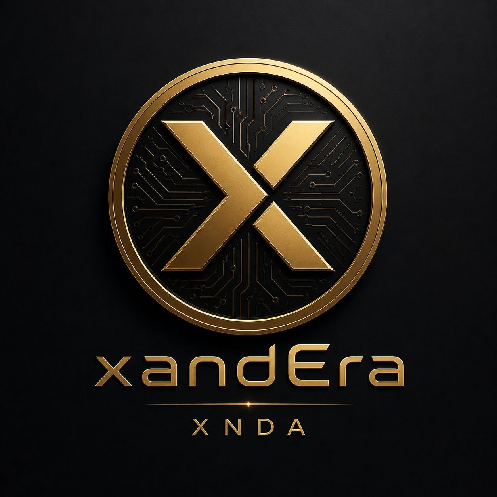

  

xandEra (XNDA) | The Era of Scarcity
xandEra is not just another token; it is a statement of digital scarcity and architectural precision. Built on the Polygon network, XNDA was designed for those who value exclusivity over mass-inflation.

💎 The Philosophy of Power
In a world of trillions, power lies in the few. We chose to drastically reduce our supply to ensure that every XNDA token carries weight. By burning over 98% of the initial supply, we have transformed xandEra into a lean, robust, and exclusive digital asset.

📊 Tokenomics at a Glance
Token Name: xandEra

Symbol: XNDA

Total Supply: 2,010,148 XNDA

Network: Polygon (POS)

Decimals: 18

Contract Address: 0x1477F49Eaac271D3c0E6e5F2a0c6a5DC538a0811

🛡️ Trust & Transparency
Verified Contract: Our code is fully verified on Polygonscan to ensure 100% transparency.

Fixed Supply: No new tokens can ever be minted. The scarcity is hardcoded.

Strategic Vesting: Major allocations are locked in smart contracts, ensuring long-term stability and protecting the community.

🌐 Vision
xandEra is designed to serve as a high-value utility token within an evolving ecosystem. We prioritize security, speed (thanks to Polygon), and, above all, the integrity of our supply.

"Mass adoption starts with trust. Growth is fueled by scarcity."

📜 License
This project is licensed under the MIT License - see the LICENSE file for details.
